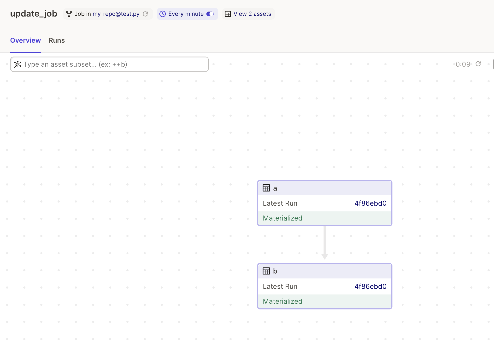

# Declarative Scheduling and Freshness Policies 

Using code to define _what_ you want to exist, not _how_ it should be created, greatly simplifies data engineering pipelines. The two main goals of an orchestrator are to run things at the correct time and in the correct order. Dagster enables both parts of orchestration to be declarative. Dagster assets let you define what should exist (correct order) and freshness policies let you define when they should exist (correct time).

## Understanding Freshness Policies

To understand declarative scheduling and freshness policies it helps to run a few experiments. Let's begin with a regular schedule:

```python
from dagster import asset, repository, define_asset_job, AssetSelection, ScheduleDefinition

@asset 
def a():
    pass

@asset 
def b(a):
    pass

update_job = define_asset_job(
    name = "update_job",
    selection = AssetSelection.keys("a", "b")
)

update_job_schedule = ScheduleDefinition(
    name = "update_job_schedule", 
    job = update_job,
    cron_schedule="* * * * *"
)

@repository
def my_repo():
    return [
        [a,b],
        [update_job_schedule]
    ]
```

When this schedule runs, asset A is updated and then asset B. This setup represents an imperative schedule. To get B updated with fresh data, you tell the orchestrator to run a job targetting A and B, and Dagster knows to run A before B.



Now let's take a step towards the declarative approach:

```python
from dagster import asset, repository, define_asset_job, AssetSelection, ScheduleDefinition, build_asset_reconciliation_sensor

@asset 
def a():
    pass

@asset 
def b(a):
    pass

update_job = define_asset_job(
    name = "update_job",
    selection = AssetSelection.keys("a")
)

update_sensor = build_asset_reconciliation_sensor(
    name = "update_sensor",
    asset_selection = AssetSelection.all()
)

update_job_schedule = ScheduleDefinition(
    name = "update_job_schedule", 
    job = update_job,
    cron_schedule="* * * * *"
)

@repository
def my_repo():
    return [
        [a,b],
        [update_job_schedule]
    ]
```

In this example we have added a reconciliation sensor and modified our job only target A. The result is that whenever A is updated by our scheduled job B is marked stale and then updated. This approach is more declarative, we are stating that "B should be as up-to-date as its dependencies" and Dagster figures out when B needs to run. 

TODO: Add 2 images, first of A and B stale, then second of A and B fresh

Let's introduce another asset, C. What if we don't need C to be as up-to-date as A and B? In the imperative world this type of scheduling quickly becomes confusing. Shoud our scheduled job target C and try to re-use A? Should it target A and C? In Dagster we can just declare how fresh we want C to be, and Dagster figures out the rest. This declaration is done through a freshness policy:

```python
from dagster import asset, repository, define_asset_job, AssetSelection, ScheduleDefinition, build_asset_reconciliation_sensor, FreshnessPolicy

@asset 
def a():
    pass

@asset 
def b(a):
    pass

@asset(
    freshness_policy = FreshnessPolicy(maximum_lag_minutes=2)
)
def c(a):
    pass

update_job = define_asset_job(
    name = "update_job",
    selection = AssetSelection.keys("a")
)

update_sensor = build_asset_reconciliation_sensor(
    name = "update_sensor",
    asset_selection = AssetSelection.all()
)

update_job_schedule = ScheduleDefinition(
    name = "update_job_schedule", 
    job = update_job,
    cron_schedule="* * * * *"
)

@repository
def my_repo():
    return [
        [a,b, c],
        [update_job_schedule]
    ]
```

One way to think about a Freshness policy is that it adds a tolerance to the reconciliation sensor. When A is updated, the reconciliation sensor immediately knows that B is stale and then runs it. The freshness policy tells the reconciliation sensor that C can tolerate being stale for up to 2 minutes. In this case, C will be updated approximately 2 minutes after A has updated.

TODO: Add 3 images, first of C Stale (but on time), then of C Late, then of C fresh and on-time

So far, we are still using a schedule to update A. Our final step is to remove this schedule:

```python
from dagster import asset, repository, define_asset_job, AssetSelection, ScheduleDefinition, build_asset_reconciliation_sensor, FreshnessPolicy

@asset 
def a():
    pass

@asset 
def b(a):
    pass

@asset(
    freshness_policy = FreshnessPolicy(maximum_lag_minutes=2)
)
def c(a):
    pass


update_sensor = build_asset_reconciliation_sensor(
    name = "update_sensor",
    asset_selection = AssetSelection.all()
)

@repository
def my_repo():
    return [
        [a,b, c]
    ]
```

Here is where the reconciliation sensor and freshness policies become really powerful. Dagster will determine that after 2 minutes C is late and violating its freshness policy. But Dagster _will also determine_ that A needs to be updated in order for C to have fresh data. Dagster will run A and C. 

TODO: Add image of C being late, then image of A and C and being fresh, C marked as on-time

> Aside: After A is updated, our reconciliation sensor is still at work, and it will update B in order to fulfill B's declaration that B should always be as up-to-date as A. So updating C is updating B as declared, but perhaps not as expected? In a real pipeline B might have its own freshness policy,

Our data assets are now fully declarative. You tell Dagster how fresh C should be and Dagster does the rest. Asset A is updated when it needs to be, not any more or less frequent. This declarative scheduling simplifies how data pipelines are built, and it helps data engineers meet the needs of their stakeholders. Freshness policies can map to data SLAs. An executive dashboard with KPIs might have a strict SLA and freshness policy with a low lag time, whereas a monthly summary may run only once a month. Dagster sorts out when the assets upstream of those datasets should run.