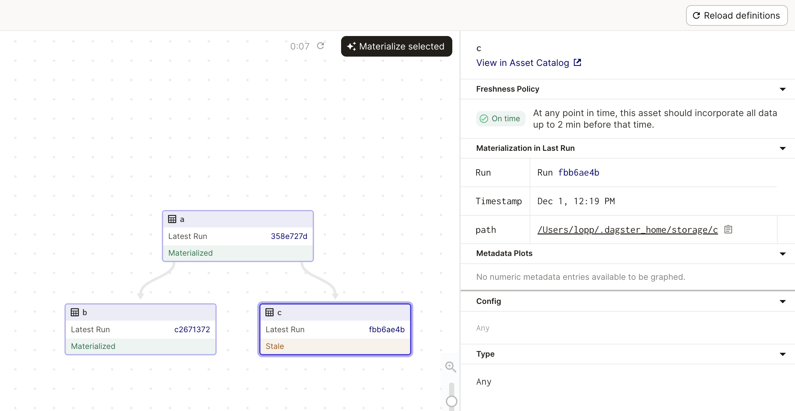

# Declarative Scheduling and Freshness Policies 

Using code to define _what_ you want to exist, not _how_ it should be created, greatly simplifies data engineering pipelines. The two main goals of an orchestrator are to run things at the correct time and in the correct order. Dagster enables both parts of orchestration to be declarative. Dagster assets let you define what should exist (correct order) and freshness policies let you define when they should exist (correct time).

## Understanding Freshness Policies

To understand declarative scheduling and freshness policies it helps to run a few experiments. Let's begin with a regular schedule:

```python
from dagster import asset, repository, define_asset_job, AssetSelection, ScheduleDefinition

@asset 
def a():
    pass

@asset 
def b(a):
    pass

update_job = define_asset_job(
    name = "update_job",
    selection = AssetSelection.keys("a", "b")
)

update_job_schedule = ScheduleDefinition(
    name = "update_job_schedule", 
    job = update_job,
    cron_schedule="* * * * *"
)

@repository
def my_repo():
    return [
        [a,b],
        [update_job_schedule]
    ]
```

When this schedule runs, asset A is updated and then asset B. This setup represents an imperative schedule. To get B updated with fresh data, you tell the orchestrator to run a job targetting A and B, and Dagster knows to run A before B.


Now let's take a step towards the declarative approach:

```python
from dagster import asset, repository, define_asset_job, AssetSelection, ScheduleDefinition, build_asset_reconciliation_sensor

@asset 
def a():
    pass

@asset 
def b(a):
    pass

update_job = define_asset_job(
    name = "update_job",
    selection = AssetSelection.keys("a")
)

update_sensor = build_asset_reconciliation_sensor(
    name = "update_sensor",
    asset_selection = AssetSelection.all()
)

update_job_schedule = ScheduleDefinition(
    name = "update_job_schedule", 
    job = update_job,
    cron_schedule="* * * * *"
)

@repository
def my_repo():
    return [
        [a,b],
        [update_job_schedule], 
        [update_sensor]
    ]
```

In this example we have added a reconciliation sensor and modified our job only target A. The result is that whenever A is updated by our scheduled job B is marked stale and then updated. This approach is more declarative, we are stating that "B should be as up-to-date as its dependencies" and Dagster figures out when B needs to run. 


Let's introduce another asset, C. What if we don't need C to be as up-to-date as A and B? In the imperative world this type of scheduling quickly becomes confusing. Shoud our scheduled job target C and try to re-use A? Should it target A and C? In Dagster we can just declare how fresh we want C to be, and Dagster figures out the rest. This declaration is done through a freshness policy:

```python
from dagster import asset, repository, define_asset_job, AssetSelection, ScheduleDefinition, build_asset_reconciliation_sensor, FreshnessPolicy

@asset 
def a():
    pass

@asset 
def b(a):
    pass

@asset(
    freshness_policy = FreshnessPolicy(maximum_lag_minutes=2)
)
def c(a):
    pass

update_job = define_asset_job(
    name = "update_job",
    selection = AssetSelection.keys("a")
)

update_sensor = build_asset_reconciliation_sensor(
    name = "update_sensor",
    asset_selection = AssetSelection.all()
)

update_job_schedule = ScheduleDefinition(
    name = "update_job_schedule", 
    job = update_job,
    cron_schedule="* * * * *"
)

@repository
def my_repo():
    return [
        [a,b,c],
        [update_job_schedule], 
        [update_sensor]
    ]
```

One way to think about a Freshness policy is that it adds a tolerance to the reconciliation sensor. When A is updated, the reconciliation sensor immediately knows that B is stale and then runs it. The freshness policy tells the reconciliation sensor that C can tolerate being stale for up to 2 minutes. In this case, C will be updated approximately 2 minutes after A has updated.

1. First A is updated by the schedule. C is marked stale but is not violating the freshness policy:



2. After 2 minutes, the C is marked late because the freshness policy is violated. A run is started to update C.


3. Once the run completes C is on-time and fresh.


So far, we are still using a schedule to update A. Our final step is to remove this schedule:

```python
from dagster import asset, repository, define_asset_job, AssetSelection, ScheduleDefinition, build_asset_reconciliation_sensor, FreshnessPolicy

@asset 
def a():
    pass

@asset 
def b(a):
    pass

@asset(
    freshness_policy = FreshnessPolicy(maximum_lag_minutes=2)
)
def c(a):
    pass


update_sensor = build_asset_reconciliation_sensor(
    name = "update_sensor",
    asset_selection = AssetSelection.all()
)

@repository
def my_repo():
    return [
        [a,b,c], 
        [update_sensor]
    ]
```

Here is where the reconciliation sensor and freshness policies become really powerful. Dagster will determine that after 2 minutes C is late and violating its freshness policy. But Dagster _will also determine_ that A needs to be updated in order for C to have fresh data. Dagster will run A and C. 

1. C is late because it was last updated more than 2 minutes ago violating the freshness policy


2. A run is triggered that updates A and C


3. A and C are both updated. B is now stale and would be updated based on it's policy.


In our code B has no policy, but B is monitored by the reconciliation sensor so it will be updated immediately. Adding a freshness policy to B is easy:

```python
from dagster import asset, repository, define_asset_job, AssetSelection, ScheduleDefinition, build_asset_reconciliation_sensor, FreshnessPolicy

@asset 
def a():
    pass

@asset(
    freshness_policy = FreshnessPolicy(maximum_lag_minutes=5)
) 
def b(a):
    pass

@asset(
    freshness_policy = FreshnessPolicy(maximum_lag_minutes=2)
)
def c(a):
    pass


update_sensor = build_asset_reconciliation_sensor(
    name = "update_sensor",
    asset_selection = AssetSelection.all()
)

@repository
def my_repo():
    return [
        [a,b,c], 
        [update_sensor]
    ]
```

When multiple freshness policies exist Dagster figures out the minimal amount of work needed to meet all of the policies. In this example, A is refreshed every 2 minutes by C, so B can be refreshed without re-running A again. In contrast, an imperative scheduler would redundantly run A for each run of B. Declarative scheduling reduces the work done by the scheduler, but more importantly, it reduces the work done by the data engineer too!

Our data assets are now fully declarative. You tell Dagster how fresh C should be and Dagster does the rest. Asset A is updated when it needs to be, not any more or less frequent. This declarative scheduling simplifies how data pipelines are built, and it helps data engineers meet the needs of their stakeholders. Freshness policies can map to data SLAs. An executive dashboard with KPIs might have a strict SLA and freshness policy with a low lag time, whereas a monthly summary may run only once a month. Dagster sorts out when the assets upstream of those datasets should run.

## Code Changes

One final concept is important when considering how assets become stale. So far this guide has focused on time passing and assets becoming stale because new data is available. Assets can also become stale if their _definition_ changes because you have updated your code. 

In Dagster it is possible to indicate that an asset is stale by updating it's `op_version`.


```python
from dagster import asset, repository, define_asset_job, AssetSelection, ScheduleDefinition, build_asset_reconciliation_sensor, FreshnessPolicy

@asset
def a():
    pass

@asset(
    op_version="0.1"
) 
def b(a):
    pass

@asset
def c(b):
    pass


update_sensor = build_asset_reconciliation_sensor(
    name = "update_sensor",
    asset_selection = AssetSelection.all()
)

@repository
def my_repo():
    return [
        [a,b, c], 
        [update_sensor]
    ]

```


If we make a substantial change to our code, we can add or increment the `op_version`:

```python
from dagster import asset, repository, define_asset_job, AssetSelection, ScheduleDefinition, build_asset_reconciliation_sensor, FreshnessPolicy

@asset
def a():
    pass

@asset(
    op_version="0.2"
) 
def b(a):
    return "significant change"

@asset
def c(b):
    pass


update_sensor = build_asset_reconciliation_sensor(
    name = "update_sensor",
    asset_selection = AssetSelection.all()
)

@repository
def my_repo():
    return [
        [a,b, c], 
        [update_sensor]
    ]
```
When the asset definitions are updated in Dagster, the changed asset and its downstream assets will be flagged as stale.


In testing environments the stale assets can be manually materialized to verify the code change.

 

In production, a reconciliation sensor will launch runs to refresh the stale assets taking into account any of their freshness policies.

